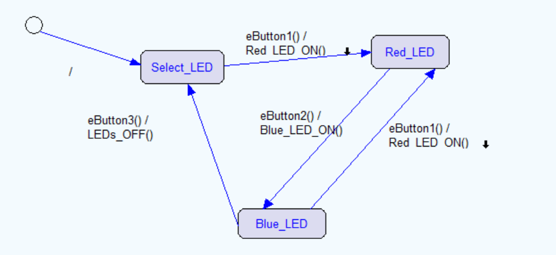

What is this?
-------------
This proyect is a simulation of a simple state machine in order to print the events and actions that are executed  
by the state machine.  
This state machine is designed with **IAR Visual State 5** and compiled using Visual Studio 2017.

Tools needed
-----------------------
* Visual Studio 2017 (to open the .sln file and re-compile the proyect)

How to run
-----------------------
1. Download the hole proyect in ZIP and decompress.
2. Open the Visual Studio proyect by clicking the **Lighting.sln** file and compile it.
3. After that, you´ll be able to run the simulation by executing **Lighting\x64\Debug\Lighting.exe**.

State machine Daigram
-----------------------

Author
----------------------
Xabier Jauregi Aguirre  
[xabier.jauregi@alumni.mondragon.edu](https://accounts.google.com/ServiceLogin)  
Mondragon Unibertsitatea  
Calle Goiuri 2  
20500, Mondragon  
